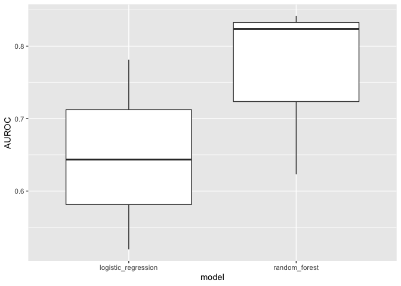

Exploratory
================
2020-09-28

``` r
library(tidyverse)
```

    ## ── Attaching packages ────────────────────────────────────────── tidyverse 1.3.0 ──

    ## ✓ ggplot2 3.3.2     ✓ purrr   0.3.4
    ## ✓ tibble  3.0.3     ✓ dplyr   1.0.2
    ## ✓ tidyr   1.1.2     ✓ stringr 1.4.0
    ## ✓ readr   1.3.1     ✓ forcats 0.5.0

    ## ── Conflicts ───────────────────────────────────────────── tidyverse_conflicts() ──
    ## x dplyr::filter() masks stats::filter()
    ## x dplyr::lag()    masks stats::lag()

``` r
penguin_data <- read_tsv('data/penguin_data.tsv')
```

    ## Parsed with column specification:
    ## cols(
    ##   species = col_character(),
    ##   island = col_character(),
    ##   bill_length_mm = col_double(),
    ##   bill_depth_mm = col_double(),
    ##   flipper_length_mm = col_double(),
    ##   body_mass_g = col_double(),
    ##   sex = col_character(),
    ##   year = col_double()
    ## )

``` r
head(penguin_data)
```

    ## # A tibble: 6 x 8
    ##   species island bill_length_mm bill_depth_mm flipper_length_… body_mass_g sex  
    ##   <chr>   <chr>           <dbl>         <dbl>            <dbl>       <dbl> <chr>
    ## 1 Adelie  Biscoe           38.8          17.2              180        3800 male 
    ## 2 Adelie  Torge…           35.2          15.9              186        3050 fema…
    ## 3 Adelie  Torge…           35.9          16.6              190        3050 fema…
    ## 4 Adelie  Torge…           38.7          19                195        3450 fema…
    ## 5 Adelie  Torge…           35.7          17                189        3350 fema…
    ## 6 Gentoo  Biscoe           45.3          13.8              208        4200 fema…
    ## # … with 1 more variable: year <dbl>

``` r
names(penguin_data)
```

    ## [1] "species"           "island"            "bill_length_mm"   
    ## [4] "bill_depth_mm"     "flipper_length_mm" "body_mass_g"      
    ## [7] "sex"               "year"

``` r
penguin_data %>% ggplot(aes(species, body_mass_g)) +
    geom_boxplot()
```

<!-- -->
