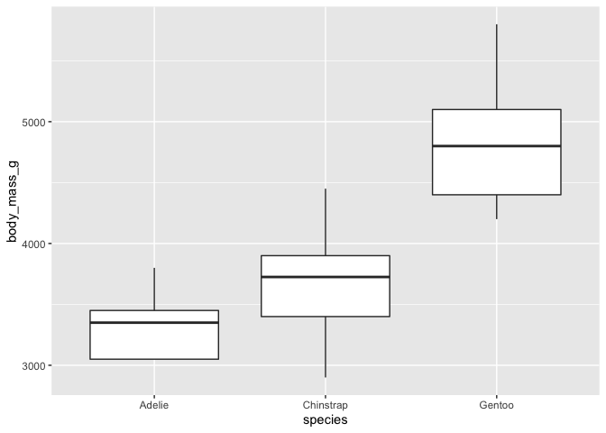
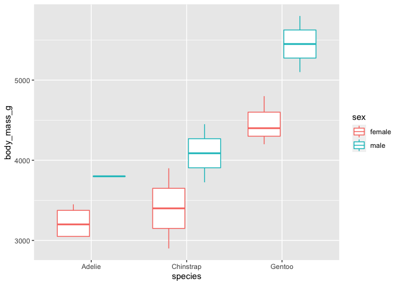

Exploratory Analysis
================
2020-10-26

``` r
library(tidyverse)
```

## 15 Sept. 2020

Reading the data and plotting body mass.

``` r
penguin_data <- read_tsv('data/penguin_data.tsv')
```

    ## 
    ## ── Column specification ────────────────────────────────────────────────────────
    ## cols(
    ##   species = col_character(),
    ##   island = col_character(),
    ##   bill_length_mm = col_double(),
    ##   bill_depth_mm = col_double(),
    ##   flipper_length_mm = col_double(),
    ##   body_mass_g = col_double(),
    ##   sex = col_character(),
    ##   year = col_double()
    ## )

``` r
head(penguin_data)
```

    ## # A tibble: 6 x 8
    ##   species island bill_length_mm bill_depth_mm flipper_length_… body_mass_g sex  
    ##   <chr>   <chr>           <dbl>         <dbl>            <dbl>       <dbl> <chr>
    ## 1 Adelie  Biscoe           38.8          17.2              180        3800 male 
    ## 2 Adelie  Torge…           35.2          15.9              186        3050 fema…
    ## 3 Adelie  Torge…           35.9          16.6              190        3050 fema…
    ## 4 Adelie  Torge…           38.7          19                195        3450 fema…
    ## 5 Adelie  Torge…           35.7          17                189        3350 fema…
    ## 6 Gentoo  Biscoe           45.3          13.8              208        4200 fema…
    ## # … with 1 more variable: year <dbl>

``` r
names(penguin_data)
```

    ## [1] "species"           "island"            "bill_length_mm"   
    ## [4] "bill_depth_mm"     "flipper_length_mm" "body_mass_g"      
    ## [7] "sex"               "year"

``` r
penguin_data %>% ggplot(aes(species, body_mass_g)) +
    geom_boxplot()
```

<!-- -->

``` r
penguin_data %>% ggplot(aes(species, body_mass_g, color = sex)) +
    geom_boxplot()
```

<!-- -->

## 19 Sept. 2020

Computing summary statistics.

``` r
penguin_data %>% group_by(species) %>% 
    select(-year) %>% 
    summarize(across(where(is.numeric), ~ mean(.x)))
```

    ## `summarise()` ungrouping output (override with `.groups` argument)

    ## # A tibble: 3 x 5
    ##   species   bill_length_mm bill_depth_mm flipper_length_mm body_mass_g
    ##   <chr>              <dbl>         <dbl>             <dbl>       <dbl>
    ## 1 Adelie              36.9          17.1              188         3340
    ## 2 Chinstrap           48.9          17.9              195.        3675
    ## 3 Gentoo              45.9          14.6              214.        4860
